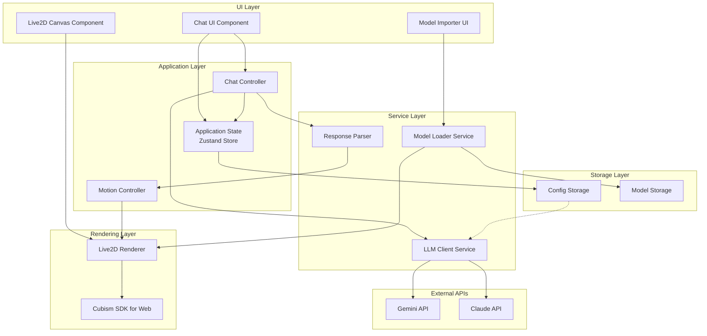

# 設計書：執事アプリケーション（Butler Assistant App）

## Overview

本設計書は、クロスプラットフォーム対応の執事アプリケーション（Butler Assistant App）の技術設計を定義します。このアプリケーションは、Live2D技術を用いた感情豊かなキャラクター表現と、LLM（Gemini/Claude）による自然な対話機能を組み合わせた、ユーザーサポートシステムです。

### 主要機能

1. **チャットベースUI**: ユーザーとの対話を時系列で表示するインターフェース
2. **Live2Dキャラクター描画**: Cubism SDK for Webを用いた執事キャラクターの描画とアニメーション
3. **LLM統合**: Gemini APIまたはClaude APIを用いた自然言語処理による回答生成
4. **構造化出力解析**: JSON形式のLLMレスポンスからテキストとモーション情報を抽出
5. **モーション連動**: 回答内容に応じたLive2Dモーションの自動再生
6. **モデルインポート**: ユーザー独自のLive2Dモデルの読み込みとカスタマイズ
7. **クロスプラットフォーム対応**: PC（Windows/Mac）とスマートフォン（iOS/Android）での動作

### 技術スタック

- **フロントエンド**: React + TypeScript
- **Live2D**: Cubism SDK for Web
- **LLM API**: Google Gemini API / Anthropic Claude API
- **デスクトップ**: Tauri（軽量、セキュア、Rust製）
- **モバイル**: Capacitor（Web技術でネイティブアプリ化）
- **状態管理**: Zustand（軽量なReact状態管理）
- **スタイリング**: Tailwind CSS（レスポンシブデザイン対応）
- **ビルドツール**: Vite

## Architecture

### システムアーキテクチャ図



### レイヤー構成

#### 1. UI Layer（UIレイヤー）

ユーザーとの直接的なインタラクションを担当するReactコンポーネント群。

- **ChatUI**: メッセージ履歴の表示、入力フィールド、送信ボタン
- **Live2DCanvas**: Live2Dキャラクターの描画領域
- **ModelImporter**: Live2Dモデルファイルの選択とインポートUI

#### 2. Application Layer（アプリケーションレイヤー）

ビジネスロジックと状態管理を担当。

- **AppState**: Zustandによるグローバル状態管理（メッセージ履歴、設定、現在のモーション状態）
- **ChatController**: チャットフローの制御（メッセージ送信、レスポンス受信、UI更新）
- **MotionController**: モーション再生のスケジューリングとキュー管理

#### 3. Service Layer（サービスレイヤー）

外部サービスとの通信やデータ処理を担当。

- **LLMClient**: Gemini/Claude APIとの通信、リクエスト構築、エラーハンドリング
- **ResponseParser**: JSON形式のLLMレスポンスの解析とバリデーション
- **ModelLoader**: Live2Dモデルファイルの読み込みと検証

#### 4. Rendering Layer（レンダリングレイヤー）

Live2Dキャラクターの描画とアニメーション制御。

- **Live2DRenderer**: Cubism SDKのラッパー、モーション再生、描画ループ管理
- **CubismSDK**: Live2D Cubism SDK for Web（外部ライブラリ）

#### 5. Storage Layer（ストレージレイヤー）

永続化データの管理。

- **ConfigStore**: APIキー、選択中のLLMプロバイダー、モデル設定の保存
- **ModelStore**: インポートされたLive2Dモデルファイルの保存

### クロスプラットフォーム戦略

#### デスクトップ版（Windows/Mac）

- **フレームワーク**: Tauri
- **理由**: 
  - Electronより軽量（Rustベース）
  - セキュリティが高い（APIキー管理に有利）
  - バイナリサイズが小さい
  - ネイティブファイルシステムアクセスが容易

#### モバイル版（iOS/Android）

- **フレームワーク**: Capacitor
- **理由**:
  - Web技術（React）をそのまま利用可能
  - ネイティブプラグインのエコシステムが充実
  - ファイルシステムアクセス、セキュアストレージのプラグインが利用可能

#### 共通コードベース

- UIコンポーネント、ビジネスロジック、サービスレイヤーは完全に共通化
- プラットフォーム固有の処理（ファイルアクセス、ストレージ）は抽象化レイヤーで吸収

```typescript
// プラットフォーム抽象化の例
interface PlatformAdapter {
  saveSecureData(key: string, value: string): Promise<void>;
  loadSecureData(key: string): Promise<string | null>;
  selectFile(options: FileSelectOptions): Promise<File | null>;
}

// Tauri実装
class TauriAdapter implements PlatformAdapter { /* ... */ }

// Capacitor実装
class CapacitorAdapter implements PlatformAdapter { /* ... */ }
```

## Components and Interfaces

### コンポーネント詳細設計

#### 1. Chat UI Component

**責務**: ユーザーとのメッセージのやり取りを表示し、入力を受け付ける。

**Props**:
```typescript
interface ChatUIProps {
  messages: Message[];
  isLoading: boolean;
  onSendMessage: (text: string) => void;
}
```

**状態**:
```typescript
interface ChatUIState {
  inputText: string;
}
```

**主要メソッド**:
- `handleInputChange(text: string)`: 入力フィールドの変更を処理
- `handleSendClick()`: 送信ボタンクリック時の処理
- `scrollToBottom()`: 新しいメッセージ追加時に自動スクロール

#### 2. Live2D Canvas Component

**責務**: Live2Dキャラクターの描画領域を提供し、レンダラーを初期化する。

**Props**:
```typescript
interface Live2DCanvasProps {
  modelPath: string;
  currentMotion: string | null;
  onMotionComplete: () => void;
}
```

**ライフサイクル**:
- `useEffect`: マウント時にLive2DRendererを初期化
- `useEffect`: currentMotionの変更を監視してモーション再生
- クリーンアップ: アンマウント時にレンダラーリソースを解放

#### 3. Model Importer Component

**責務**: ユーザーがLive2Dモデルをインポートするためのインターフェースを提供。

**Props**:
```typescript
interface ModelImporterProps {
  onImportSuccess: (modelConfig: ModelConfig) => void;
  onImportError: (error: Error) => void;
}
```

**主要メソッド**:
- `handleFileSelect()`: ファイル選択ダイアログを開く
- `validateModelFiles(files: File[])`: モデルファイルの妥当性を検証
- `importModel(files: File[])`: モデルをストレージに保存

### サービスインターフェース

#### LLM Client Service

```typescript
interface LLMClientService {
  /**
   * LLMにメッセージを送信し、構造化された回答を取得
   * @param message ユーザーメッセージ
   * @param history 会話履歴（オプション）
   * @returns 構造化されたレスポンス
   * @throws NetworkError, APIError, RateLimitError
   */
  sendMessage(
    message: string,
    history?: ConversationHistory
  ): Promise<StructuredResponse>;

  /**
   * 使用するLLMプロバイダーを設定
   * @param provider 'gemini' | 'claude'
   */
  setProvider(provider: LLMProvider): void;

  /**
   * APIキーを設定
   * @param apiKey APIキー文字列
   */
  setApiKey(apiKey: string): void;
}
```

#### Response Parser Service

```typescript
interface ResponseParserService {
  /**
   * LLMからのJSON文字列を解析
   * @param jsonString JSON形式の文字列
   * @returns 解析されたレスポンスオブジェクト
   * @throws ParseError
   */
  parse(jsonString: string): ParsedResponse;

  /**
   * レスポンスオブジェクトをJSON文字列にシリアライズ
   * @param response レスポンスオブジェクト
   * @returns JSON形式の文字列
   */
  serialize(response: ParsedResponse): string;

  /**
   * レスポンスの妥当性を検証
   * @param response レスポンスオブジェクト
   * @returns 検証結果
   */
  validate(response: unknown): ValidationResult;
}
```

#### Motion Controller Service

```typescript
interface MotionControllerService {
  /**
   * モーションを再生キューに追加
   * @param motionTag モーションタグ（例: 'bow', 'smile'）
   */
  playMotion(motionTag: string): void;

  /**
   * 現在再生中のモーションを取得
   * @returns 現在のモーションタグ、または null
   */
  getCurrentMotion(): string | null;

  /**
   * モーション再生完了時のコールバックを登録
   * @param callback コールバック関数
   */
  onMotionComplete(callback: () => void): void;

  /**
   * 待機モーションに戻る
   */
  returnToIdle(): void;
}
```

#### Live2D Renderer Service

```typescript
interface Live2DRendererService {
  /**
   * Live2Dモデルを初期化
   * @param canvas 描画対象のCanvas要素
   * @param modelPath モデルファイルのパス
   */
  initialize(canvas: HTMLCanvasElement, modelPath: string): Promise<void>;

  /**
   * モーションを再生
   * @param motionGroup モーショングループ名
   * @param motionIndex モーションインデックス
   * @param priority 優先度
   */
  startMotion(
    motionGroup: string,
    motionIndex: number,
    priority: MotionPriority
  ): void;

  /**
   * 描画ループを開始
   */
  startRendering(): void;

  /**
   * 描画ループを停止
   */
  stopRendering(): void;

  /**
   * リソースを解放
   */
  dispose(): void;

  /**
   * キャンバスサイズを更新
   * @param width 幅
   * @param height 高さ
   */
  resize(width: number, height: number): void;
}
```

#### Model Loader Service

```typescript
interface ModelLoaderService {
  /**
   * Live2Dモデルを読み込み
   * @param files モデルファイル一式
   * @returns モデル設定オブジェクト
   * @throws ValidationError
   */
  loadModel(files: File[]): Promise<ModelConfig>;

  /**
   * モデルファイルの妥当性を検証
   * @param files モデルファイル一式
   * @returns 検証結果
   */
  validateModelFiles(files: File[]): ValidationResult;

  /**
   * モデルをストレージに保存
   * @param modelConfig モデル設定
   */
  saveModel(modelConfig: ModelConfig): Promise<void>;

  /**
   * 保存されたモデル一覧を取得
   * @returns モデル設定の配列
   */
  listModels(): Promise<ModelConfig[]>;
}
```

## Data Models

### メッセージデータモデル

```typescript
/**
 * チャットメッセージ
 */
interface Message {
  id: string;              // 一意識別子（UUID）
  role: 'user' | 'assistant'; // メッセージの送信者
  content: string;         // メッセージ本文
  timestamp: number;       // Unix timestamp（ミリ秒）
  motion?: string;         // 関連するモーションタグ（assistantのみ）
}

/**
 * 会話履歴
 */
interface ConversationHistory {
  messages: Message[];
  maxLength: number;       // 保持する最大メッセージ数
}
```

### LLMレスポンスデータモデル

```typescript
/**
 * LLMからの構造化レスポンス（JSON形式）
 */
interface StructuredResponse {
  text: string;            // 回答テキスト
  motion: string;          // モーションタグ
}

/**
 * 解析済みレスポンス
 */
interface ParsedResponse {
  text: string;
  motion: string;
  isValid: boolean;        // 解析が成功したか
  errors?: string[];       // 解析エラーの詳細
}

/**
 * バリデーション結果
 */
interface ValidationResult {
  isValid: boolean;
  errors: ValidationError[];
}

interface ValidationError {
  field: string;
  message: string;
}
```

### Live2Dモデルデータモデル

```typescript
/**
 * Live2Dモデル設定
 */
interface ModelConfig {
  id: string;              // モデルの一意識別子
  name: string;            // モデル名
  modelPath: string;       // .model3.jsonファイルのパス
  textures: string[];      // テクスチャファイルのパス配列
  motions: MotionMapping;  // モーションタグとファイルのマッピング
  createdAt: number;       // インポート日時
}

/**
 * モーションマッピング
 */
interface MotionMapping {
  [motionTag: string]: MotionDefinition;
}

interface MotionDefinition {
  group: string;           // Cubism SDKのモーショングループ名
  index: number;           // グループ内のインデックス
  file: string;            // モーションファイルのパス
}

/**
 * デフォルトモーションマッピング
 */
const DEFAULT_MOTION_MAPPING: MotionMapping = {
  idle: { group: 'Idle', index: 0, file: 'idle.motion3.json' },
  bow: { group: 'TapBody', index: 0, file: 'bow.motion3.json' },
  smile: { group: 'TapBody', index: 1, file: 'smile.motion3.json' },
  think: { group: 'TapBody', index: 2, file: 'think.motion3.json' },
  nod: { group: 'TapBody', index: 3, file: 'nod.motion3.json' },
};
```

### アプリケーション設定データモデル

```typescript
/**
 * アプリケーション設定
 */
interface AppConfig {
  llm: LLMConfig;
  model: ModelReference;
  ui: UIConfig;
}

interface LLMConfig {
  provider: 'gemini' | 'claude';
  apiKey: string;          // 暗号化して保存
  systemPrompt: string;    // 執事キャラクターのプロンプト
  temperature: number;     // 0.0 - 1.0
  maxTokens: number;
}

interface ModelReference {
  currentModelId: string;  // 現在使用中のモデルID
}

interface UIConfig {
  theme: 'light' | 'dark';
  fontSize: number;
  characterSize: number;   // Live2Dキャラクターの表示サイズ（%）
}
```

### エラーデータモデル

```typescript
/**
 * アプリケーションエラー
 */
abstract class AppError extends Error {
  constructor(
    message: string,
    public code: string,
    public details?: unknown
  ) {
    super(message);
    this.name = this.constructor.name;
  }
}

class NetworkError extends AppError {
  constructor(message: string, details?: unknown) {
    super(message, 'NETWORK_ERROR', details);
  }
}

class APIError extends AppError {
  constructor(message: string, public statusCode: number, details?: unknown) {
    super(message, 'API_ERROR', details);
  }
}

class RateLimitError extends AppError {
  constructor(message: string, public retryAfter?: number) {
    super(message, 'RATE_LIMIT_ERROR', { retryAfter });
  }
}

class ParseError extends AppError {
  constructor(message: string, details?: unknown) {
    super(message, 'PARSE_ERROR', details);
  }
}

class ValidationError extends AppError {
  constructor(message: string, public errors: ValidationError[]) {
    super(message, 'VALIDATION_ERROR', { errors });
  }
}

class ModelLoadError extends AppError {
  constructor(message: string, details?: unknown) {
    super(message, 'MODEL_LOAD_ERROR', details);
  }
}
```

### 状態管理データモデル（Zustand Store）

```typescript
/**
 * グローバルアプリケーション状態
 */
interface AppState {
  // メッセージ関連
  messages: Message[];
  isLoading: boolean;
  
  // Live2D関連
  currentMotion: string | null;
  isMotionPlaying: boolean;
  motionQueue: string[];
  
  // 設定関連
  config: AppConfig;
  
  // エラー関連
  lastError: AppError | null;
  
  // アクション
  addMessage: (message: Message) => void;
  setLoading: (isLoading: boolean) => void;
  setCurrentMotion: (motion: string | null) => void;
  enqueueMotion: (motion: string) => void;
  dequeueMotion: () => string | null;
  updateConfig: (config: Partial<AppConfig>) => void;
  setError: (error: AppError | null) => void;
  clearMessages: () => void;
}
```


## Live2D Cubism SDK for Web 組み込み方針

### SDK選定

**使用SDK**: Cubism SDK for Web (Cubism 4 SDK)

**選定理由**:
- 公式のWeb向けSDK
- TypeScript型定義が利用可能
- Canvas/WebGLベースでReactと統合しやすい
- クロスプラットフォーム対応（ブラウザベース）

### 統合アーキテクチャ

```typescript
// Live2Dレンダラーの実装構造
class Live2DRenderer {
  private app: LAppDelegate;           // Cubism SDKのアプリケーション
  private model: LAppModel | null;     // 現在のモデル
  private canvas: HTMLCanvasElement;   // 描画対象Canvas
  private gl: WebGLRenderingContext;   // WebGLコンテキスト
  private frameId: number | null;      // requestAnimationFrameのID
  
  async initialize(canvas: HTMLCanvasElement, modelPath: string): Promise<void> {
    this.canvas = canvas;
    this.gl = canvas.getContext('webgl') as WebGLRenderingContext;
    
    // Cubism SDKの初期化
    CubismFramework.startUp();
    CubismFramework.initialize();
    
    // モデルの読み込み
    await this.loadModel(modelPath);
    
    // 描画ループの開始
    this.startRendering();
  }
  
  private async loadModel(modelPath: string): Promise<void> {
    // .model3.jsonを読み込み
    const response = await fetch(modelPath);
    const modelJson = await response.json();
    
    // モデルインスタンスを作成
    this.model = new LAppModel();
    await this.model.loadAssets(modelPath, modelJson);
  }
  
  startMotion(motionGroup: string, motionIndex: number, priority: number): void {
    if (!this.model) return;
    this.model.startMotion(motionGroup, motionIndex, priority);
  }
  
  private render(): void {
    if (!this.model || !this.gl) return;
    
    // 画面クリア
    this.gl.clearColor(0.0, 0.0, 0.0, 0.0);
    this.gl.clear(this.gl.COLOR_BUFFER_BIT);
    
    // モデルの更新と描画
    this.model.update();
    this.model.draw(this.gl);
    
    // 次のフレームをスケジュール
    this.frameId = requestAnimationFrame(() => this.render());
  }
  
  startRendering(): void {
    if (this.frameId !== null) return;
    this.render();
  }
  
  stopRendering(): void {
    if (this.frameId !== null) {
      cancelAnimationFrame(this.frameId);
      this.frameId = null;
    }
  }
  
  dispose(): void {
    this.stopRendering();
    if (this.model) {
      this.model.release();
      this.model = null;
    }
    CubismFramework.dispose();
  }
  
  resize(width: number, height: number): void {
    this.canvas.width = width;
    this.canvas.height = height;
    if (this.model) {
      this.model.resize(width, height);
    }
  }
}
```

### Reactコンポーネントとの統合

```typescript
const Live2DCanvas: React.FC<Live2DCanvasProps> = ({
  modelPath,
  currentMotion,
  onMotionComplete
}) => {
  const canvasRef = useRef<HTMLCanvasElement>(null);
  const rendererRef = useRef<Live2DRenderer | null>(null);
  
  // レンダラーの初期化
  useEffect(() => {
    if (!canvasRef.current) return;
    
    const renderer = new Live2DRenderer();
    rendererRef.current = renderer;
    
    renderer.initialize(canvasRef.current, modelPath).catch(error => {
      console.error('Live2D初期化エラー:', error);
    });
    
    return () => {
      renderer.dispose();
    };
  }, [modelPath]);
  
  // モーション再生
  useEffect(() => {
    if (!currentMotion || !rendererRef.current) return;
    
    const motionDef = getMotionDefinition(currentMotion);
    if (motionDef) {
      rendererRef.current.startMotion(
        motionDef.group,
        motionDef.index,
        MotionPriority.NORMAL
      );
      
      // モーション完了を監視（簡易実装）
      setTimeout(() => {
        onMotionComplete();
      }, 2000); // 実際はモーションの長さを取得
    }
  }, [currentMotion, onMotionComplete]);
  
  // リサイズ対応
  useEffect(() => {
    const handleResize = () => {
      if (canvasRef.current && rendererRef.current) {
        const { width, height } = canvasRef.current.getBoundingClientRect();
        rendererRef.current.resize(width, height);
      }
    };
    
    window.addEventListener('resize', handleResize);
    handleResize();
    
    return () => window.removeEventListener('resize', handleResize);
  }, []);
  
  return (
    <canvas
      ref={canvasRef}
      className="live2d-canvas"
      style={{ width: '100%', height: '100%' }}
    />
  );
};
```

### モーション管理

```typescript
/**
 * モーション定義を取得
 */
function getMotionDefinition(motionTag: string): MotionDefinition | null {
  const config = useAppStore.getState().config;
  const modelId = config.model.currentModelId;
  
  // モデル設定からモーションマッピングを取得
  const modelConfig = getModelConfig(modelId);
  return modelConfig?.motions[motionTag] || DEFAULT_MOTION_MAPPING[motionTag] || null;
}

/**
 * モーション優先度
 */
enum MotionPriority {
  NONE = 0,
  IDLE = 1,
  NORMAL = 2,
  FORCE = 3
}
```

### パフォーマンス最適化

1. **描画ループの最適化**
   - `requestAnimationFrame`を使用して60FPS維持
   - バックグラウンド時は描画を停止

2. **メモリ管理**
   - コンポーネントアンマウント時に確実にリソース解放
   - 使用していないモデルはメモリから削除

3. **テクスチャ最適化**
   - テクスチャサイズを適切に設定（2048x2048推奨）
   - モバイルでは解像度を下げる

## LLM API通信設計

### API選定と構造化出力

#### Gemini API

**エンドポイント**: `https://generativelanguage.googleapis.com/v1beta/models/gemini-pro:generateContent`

**構造化出力の実現方法**:
- `response_mime_type: "application/json"`を指定
- `response_schema`でJSONスキーマを定義

```typescript
const geminiRequest = {
  contents: [
    {
      role: 'user',
      parts: [{ text: userMessage }]
    }
  ],
  systemInstruction: {
    parts: [{ text: BUTLER_SYSTEM_PROMPT }]
  },
  generationConfig: {
    temperature: 0.7,
    maxOutputTokens: 1024,
    responseMimeType: 'application/json',
    responseSchema: {
      type: 'object',
      properties: {
        text: {
          type: 'string',
          description: '執事としての回答テキスト'
        },
        motion: {
          type: 'string',
          enum: ['idle', 'bow', 'smile', 'think', 'nod'],
          description: '回答に適したモーションタグ'
        }
      },
      required: ['text', 'motion']
    }
  }
};
```

#### Claude API

**エンドポイント**: `https://api.anthropic.com/v1/messages`

**構造化出力の実現方法**:
- システムプロンプトでJSON形式を指示
- `response_format`パラメータ（将来的にサポート予定）

```typescript
const claudeRequest = {
  model: 'claude-3-5-sonnet-20241022',
  max_tokens: 1024,
  temperature: 0.7,
  system: BUTLER_SYSTEM_PROMPT + '\n\n必ず以下のJSON形式で回答してください：\n{"text": "回答テキスト", "motion": "モーションタグ"}',
  messages: [
    {
      role: 'user',
      content: userMessage
    }
  ]
};
```

### LLM Client実装

```typescript
class LLMClient implements LLMClientService {
  private provider: LLMProvider = 'gemini';
  private apiKey: string = '';
  private systemPrompt: string = BUTLER_SYSTEM_PROMPT;
  
  setProvider(provider: LLMProvider): void {
    this.provider = provider;
  }
  
  setApiKey(apiKey: string): void {
    this.apiKey = apiKey;
  }
  
  async sendMessage(
    message: string,
    history?: ConversationHistory
  ): Promise<StructuredResponse> {
    if (this.provider === 'gemini') {
      return this.sendToGemini(message, history);
    } else {
      return this.sendToClaude(message, history);
    }
  }
  
  private async sendToGemini(
    message: string,
    history?: ConversationHistory
  ): Promise<StructuredResponse> {
    const url = `https://generativelanguage.googleapis.com/v1beta/models/gemini-pro:generateContent?key=${this.apiKey}`;
    
    const contents = this.buildGeminiContents(message, history);
    
    const response = await fetch(url, {
      method: 'POST',
      headers: {
        'Content-Type': 'application/json'
      },
      body: JSON.stringify({
        contents,
        systemInstruction: {
          parts: [{ text: this.systemPrompt }]
        },
        generationConfig: {
          temperature: 0.7,
          maxOutputTokens: 1024,
          responseMimeType: 'application/json',
          responseSchema: RESPONSE_SCHEMA
        }
      })
    });
    
    if (!response.ok) {
      throw this.handleAPIError(response);
    }
    
    const data = await response.json();
    const jsonText = data.candidates[0].content.parts[0].text;
    return JSON.parse(jsonText) as StructuredResponse;
  }
  
  private async sendToClaude(
    message: string,
    history?: ConversationHistory
  ): Promise<StructuredResponse> {
    const url = 'https://api.anthropic.com/v1/messages';
    
    const messages = this.buildClaudeMessages(message, history);
    
    const response = await fetch(url, {
      method: 'POST',
      headers: {
        'Content-Type': 'application/json',
        'x-api-key': this.apiKey,
        'anthropic-version': '2023-06-01'
      },
      body: JSON.stringify({
        model: 'claude-3-5-sonnet-20241022',
        max_tokens: 1024,
        temperature: 0.7,
        system: this.systemPrompt + '\n\n必ず以下のJSON形式で回答してください：\n{"text": "回答テキスト", "motion": "モーションタグ(idle/bow/smile/think/nod)"}',
        messages
      })
    });
    
    if (!response.ok) {
      throw this.handleAPIError(response);
    }
    
    const data = await response.json();
    const jsonText = data.content[0].text;
    
    // ClaudeはJSON以外のテキストも含む可能性があるため、抽出処理
    const jsonMatch = jsonText.match(/\{[\s\S]*\}/);
    if (!jsonMatch) {
      throw new ParseError('JSON形式のレスポンスが見つかりません');
    }
    
    return JSON.parse(jsonMatch[0]) as StructuredResponse;
  }
  
  private buildGeminiContents(
    message: string,
    history?: ConversationHistory
  ): any[] {
    const contents = [];
    
    // 履歴を追加
    if (history) {
      for (const msg of history.messages) {
        contents.push({
          role: msg.role === 'user' ? 'user' : 'model',
          parts: [{ text: msg.content }]
        });
      }
    }
    
    // 現在のメッセージを追加
    contents.push({
      role: 'user',
      parts: [{ text: message }]
    });
    
    return contents;
  }
  
  private buildClaudeMessages(
    message: string,
    history?: ConversationHistory
  ): any[] {
    const messages = [];
    
    // 履歴を追加
    if (history) {
      for (const msg of history.messages) {
        messages.push({
          role: msg.role,
          content: msg.content
        });
      }
    }
    
    // 現在のメッセージを追加
    messages.push({
      role: 'user',
      content: message
    });
    
    return messages;
  }
  
  private handleAPIError(response: Response): AppError {
    if (response.status === 429) {
      const retryAfter = response.headers.get('Retry-After');
      return new RateLimitError(
        'APIレート制限に達しました。しばらく待ってから再試行してください。',
        retryAfter ? parseInt(retryAfter) : undefined
      );
    } else if (response.status >= 500) {
      return new APIError(
        'APIサーバーエラーが発生しました。',
        response.status
      );
    } else if (response.status === 401) {
      return new APIError(
        'APIキーが無効です。設定を確認してください。',
        response.status
      );
    } else {
      return new APIError(
        `APIエラーが発生しました（ステータス: ${response.status}）`,
        response.status
      );
    }
  }
}

// レスポンススキーマ定義
const RESPONSE_SCHEMA = {
  type: 'object',
  properties: {
    text: {
      type: 'string',
      description: '執事としての回答テキスト'
    },
    motion: {
      type: 'string',
      enum: ['idle', 'bow', 'smile', 'think', 'nod'],
      description: '回答に適したモーションタグ'
    }
  },
  required: ['text', 'motion']
};

// 執事キャラクターのシステムプロンプト
const BUTLER_SYSTEM_PROMPT = `あなたは優秀な執事です。ユーザーの質問に対して、丁寧で礼儀正しく、かつ的確に回答してください。

回答の際は、以下のガイドラインに従ってください：
- 常に敬語を使用する
- ユーザーを「お客様」または「ご主人様」と呼ぶ
- 質問の意図を正確に理解し、簡潔かつ明確に回答する
- 不明な点があれば、丁寧に確認する
- 回答に適した感情表現（モーション）を選択する

モーションの選択基準：
- bow: 挨拶、謝罪、感謝の場面
- smile: 肯定的な回答、励まし、喜びの場面
- think: 考察、説明、複雑な回答の場面
- nod: 同意、確認、簡潔な肯定の場面
- idle: 中立的な回答、待機状態`;
```

### エラーハンドリング戦略

```typescript
/**
 * LLM通信のエラーハンドリング
 */
async function handleLLMRequest(
  client: LLMClient,
  message: string
): Promise<ParsedResponse> {
  try {
    const response = await client.sendMessage(message);
    return responseParser.parse(JSON.stringify(response));
  } catch (error) {
    if (error instanceof NetworkError) {
      // ネットワークエラー
      return {
        text: '申し訳ございません。ネットワーク接続を確認してください。',
        motion: 'bow',
        isValid: false,
        errors: ['ネットワークエラー']
      };
    } else if (error instanceof RateLimitError) {
      // レート制限
      return {
        text: '申し訳ございません。しばらく待ってから再度お試しください。',
        motion: 'bow',
        isValid: false,
        errors: ['レート制限']
      };
    } else if (error instanceof APIError) {
      // APIエラー
      return {
        text: '申し訳ございません。サービスに一時的な問題が発生しています。',
        motion: 'bow',
        isValid: false,
        errors: ['APIエラー']
      };
    } else if (error instanceof ParseError) {
      // 解析エラー
      return {
        text: '申し訳ございません。回答の処理中にエラーが発生しました。',
        motion: 'bow',
        isValid: false,
        errors: ['解析エラー']
      };
    } else {
      // その他のエラー
      return {
        text: '申し訳ございません。予期しないエラーが発生しました。',
        motion: 'bow',
        isValid: false,
        errors: ['不明なエラー']
      };
    }
  }
}
```

### リトライ戦略

```typescript
/**
 * 指数バックオフによるリトライ
 */
async function retryWithBackoff<T>(
  fn: () => Promise<T>,
  maxRetries: number = 3,
  baseDelay: number = 1000
): Promise<T> {
  let lastError: Error;
  
  for (let i = 0; i < maxRetries; i++) {
    try {
      return await fn();
    } catch (error) {
      lastError = error as Error;
      
      // リトライ不可能なエラーは即座に失敗
      if (error instanceof APIError && error.statusCode === 401) {
        throw error;
      }
      
      // 最後の試行では待機しない
      if (i < maxRetries - 1) {
        const delay = baseDelay * Math.pow(2, i);
        await new Promise(resolve => setTimeout(resolve, delay));
      }
    }
  }
  
  throw lastError!;
}
```


## Correctness Properties

*プロパティとは、システムのすべての有効な実行において真であるべき特性や振る舞いのことです。本質的には、システムが何をすべきかについての形式的な記述です。プロパティは、人間が読める仕様と機械で検証可能な正確性保証との橋渡しとなります。*

以下のプロパティは、要件定義書の受入基準から導出され、プロパティベーステスト（PBT）によって検証されます。各プロパティは「すべての〜について」という普遍量化を含み、ランダムに生成された多数の入力に対してテストされます。

### Property 1: メッセージ表示の時系列順序保持

*任意の*メッセージ配列について、Chat UIコンポーネントでレンダリングした後、DOM要素の順序がメッセージのタイムスタンプ順と一致する

**検証要件: 1.1**

### Property 2: メッセージ送信後の履歴追加

*任意の*有効なメッセージテキストについて、送信処理を実行した後、メッセージ履歴の長さが1増加し、最後の要素が送信したメッセージと一致する

**検証要件: 1.4**

### Property 3: 画面サイズに応じた表示調整

*任意の*画面サイズ（幅、高さ）について、Live2D Rendererのresize関数を呼び出した後、キャラクターの表示が画面サイズに適切に調整される

**検証要件: 2.5**

### Property 4: LLMリクエスト送信

*任意の*ユーザーメッセージについて、LLM ClientのsendMessage関数を呼び出すと、設定されたプロバイダー（GeminiまたはClaude）のAPIエンドポイントにHTTPリクエストが送信される

**検証要件: 3.1**

### Property 5: APIエラー時の適切なエラー返却

*任意の*APIエラー状態（ネットワークエラー、レート制限、認証エラーなど）について、LLM Clientは対応する適切なエラー型（NetworkError、RateLimitError、APIError）を返す

**検証要件: 3.4**

### Property 6: JSON解析とオブジェクト変換

*任意の*有効なStructuredResponse形式のJSON文字列について、Response Parserのparse関数は正しくParsedResponseオブジェクトに変換する

**検証要件: 4.1, 8.1**

### Property 7: 必須フィールドの抽出

*任意の*textフィールドとmotionフィールドを含むJSONオブジェクトについて、Response Parserは両方のフィールドを正しく抽出する

**検証要件: 4.2, 4.3**

### Property 8: 不正JSON時のデフォルト値返却

*任意の*不正なJSON文字列（構文エラー、必須フィールド欠落など）について、Response Parserはエラーをスローせず、デフォルトの回答テキストとモーションを含むParsedResponseを返す

**検証要件: 4.4**

### Property 9: モーションタグに対応するモーション再生

*任意の*有効なモーションタグ（bow、smile、think、nod、idle）について、Motion ControllerのplayMotion関数を呼び出すと、対応するLive2Dモーションが再生キューに追加される

**検証要件: 5.1**

### Property 10: 無効モーションタグ時のデフォルト動作

*任意の*無効なモーションタグ（定義されていないランダムな文字列）について、Motion Controllerはエラーをスローせず、デフォルトの待機モーション（idle）を再生する

**検証要件: 5.3**

### Property 11: モーション再生完了後の待機状態復帰

*任意の*モーション（idle以外）について、再生完了後にMotion Controllerの状態を確認すると、currentMotionがidleに戻っている

**検証要件: 5.4**

### Property 12: モーション再生中のキュー追加

*任意の*モーション再生中の状態において、新しいモーションリクエストを送信すると、そのモーションがキューに追加され、現在のモーションは中断されない

**検証要件: 5.5**

### Property 13: モデルファイルの読み込み

*任意の*有効なLive2Dモデルファイルセット（.model3.json、テクスチャ、モーションファイル）について、Model LoaderのloadModel関数は正常にModelConfigオブジェクトを返す

**検証要件: 7.1**

### Property 14: モデルファイルの妥当性検証

*任意の*ファイルセットについて、Model LoaderのvalidateModelFiles関数は、有効なファイルセットに対してはisValid=trueを、無効なファイルセットに対してはisValid=falseとエラー詳細を返す

**検証要件: 7.2**

### Property 15: 不正モデルファイル時のエラー返却

*任意の*不正なモデルファイル（必須ファイル欠落、フォーマットエラーなど）について、Model LoaderのloadModel関数はModelLoadErrorをスローする

**検証要件: 7.3**

### Property 16: モデル設定の永続化ラウンドトリップ

*任意の*有効なModelConfigオブジェクトについて、保存→読み込みを行った結果が元のオブジェクトと等価である

**検証要件: 7.5**

### Property 17: レスポンスのシリアライズとデシリアライズ

*任意の*有効なParsedResponseオブジェクトについて、Response ParserのserializeでJSON文字列に変換し、再度parseで解析した結果が元のオブジェクトと等価である（ラウンドトリッププロパティ）

**検証要件: 8.2, 8.3**

### Property 18: 必須フィールドの検証

*任意の*オブジェクトについて、Response Parserのvalidateでtextフィールドまたはmotionフィールドが欠落している場合、ValidationResultのisValidがfalseとなり、適切なエラー情報が含まれる

**検証要件: 8.4**

### Property 19: 必須フィールド欠落時のデフォルト値補完

*任意の*textまたはmotionフィールドが欠落したオブジェクトについて、Response Parserのparse関数はデフォルト値を補完したParsedResponseを返す

**検証要件: 8.5**

### Property 20: APIキーのログ出力防止

*任意の*エラー状態において、生成されるエラーメッセージやログ出力にAPIキー文字列が含まれていない

**検証要件: 9.5**

### Property 21: エラー発生時のモーション再生

*任意の*エラー（NetworkError、APIError、ParseErrorなど）が発生した場合、Motion Controllerは困惑または謝罪のモーション（bowまたはthink）を再生する

**検証要件: 10.4**

### Property 22: エラーのログ記録

*任意の*エラーが発生した場合、そのエラー情報（エラー型、メッセージ、タイムスタンプ）がログファイルに記録される

**検証要件: 10.5**

### Property 23: 画面サイズ変更時のレイアウト調整

*任意の*画面サイズ変更（幅と高さの変更）について、UIコンポーネントは新しいサイズに応じてレイアウトを動的に調整する

**検証要件: 11.3**


## Error Handling

### エラー分類と処理戦略

アプリケーションで発生する可能性のあるエラーを以下のカテゴリに分類し、それぞれに適した処理を実装します。

#### 1. ネットワークエラー（NetworkError）

**発生条件**:
- インターネット接続の切断
- タイムアウト
- DNS解決失敗

**処理方針**:
- ユーザーに「ネットワーク接続を確認してください」というメッセージを表示
- 執事キャラクターがお辞儀（bow）モーションを再生
- 自動リトライは行わず、ユーザーの再送信を待つ
- エラー詳細をログに記録

**実装例**:
```typescript
try {
  const response = await fetch(apiUrl);
} catch (error) {
  if (error instanceof TypeError && error.message.includes('fetch')) {
    throw new NetworkError('ネットワーク接続を確認してください');
  }
}
```

#### 2. APIエラー（APIError）

**発生条件**:
- 401 Unauthorized（APIキー無効）
- 403 Forbidden（権限不足）
- 500 Internal Server Error（サーバーエラー）
- その他のHTTPエラーステータス

**処理方針**:
- 401エラー: 「APIキーが無効です。設定を確認してください」
- 500エラー: 「サービスに一時的な問題が発生しています」
- その他: ステータスコードを含むエラーメッセージ
- 執事キャラクターがお辞儀（bow）モーションを再生
- エラー詳細をログに記録

#### 3. レート制限エラー（RateLimitError）

**発生条件**:
- 429 Too Many Requests
- APIの使用量制限に達した

**処理方針**:
- ユーザーに「しばらく待ってから再試行してください」というメッセージを表示
- Retry-Afterヘッダーがあれば待機時間を表示
- 執事キャラクターがお辞儀（bow）モーションを再生
- エラー詳細をログに記録

#### 4. 解析エラー（ParseError）

**発生条件**:
- LLMからのレスポンスがJSON形式でない
- JSON構文エラー
- 予期しないレスポンス構造

**処理方針**:
- デフォルトの回答テキストとモーションを使用
- ユーザーには「回答の処理中にエラーが発生しました」と表示
- 執事キャラクターがお辞儀（bow）モーションを再生
- 元のレスポンステキストをログに記録（デバッグ用）

#### 5. バリデーションエラー（ValidationError）

**発生条件**:
- 必須フィールドの欠落
- フィールド型の不一致
- 値の範囲外

**処理方針**:
- デフォルト値で補完して処理を継続
- エラー詳細をログに記録
- ユーザーには通常通り回答を表示（エラーを隠蔽）

#### 6. モデル読み込みエラー（ModelLoadError）

**発生条件**:
- Live2Dモデルファイルの欠落
- ファイル形式の不正
- テクスチャ読み込み失敗

**処理方針**:
- ユーザーに「モデルの読み込みに失敗しました」というメッセージを表示
- デフォルトの静的画像を表示
- エラー詳細（ファイル名、エラー理由）をログに記録
- インポート処理の場合は、ユーザーにファイルの確認を促す

### エラーログ記録

すべてのエラーは以下の形式でログファイルに記録されます。

```typescript
interface ErrorLog {
  timestamp: number;           // Unix timestamp
  errorType: string;           // エラークラス名
  errorCode: string;           // エラーコード
  message: string;             // エラーメッセージ
  details?: unknown;           // 追加情報（APIキーは除外）
  stackTrace?: string;         // スタックトレース
  userAction?: string;         // エラー発生時のユーザー操作
}
```

**ログファイルの保存場所**:
- デスクトップ版（Tauri）: `~/.butler-app/logs/error.log`
- モバイル版（Capacitor）: アプリのドキュメントディレクトリ

**ログローテーション**:
- ログファイルサイズが10MBを超えたら新しいファイルを作成
- 最大5ファイルまで保持（古いファイルから削除）

### ユーザー通知の実装

エラー発生時のユーザー通知は、以下のコンポーネントで実装します。

```typescript
interface ErrorNotification {
  message: string;             // ユーザー向けメッセージ
  severity: 'error' | 'warning' | 'info';
  motion: string;              // 執事のモーション
  action?: {                   // オプションのアクション
    label: string;
    onClick: () => void;
  };
}

// 使用例
const showError = (error: AppError) => {
  const notification: ErrorNotification = {
    message: error.message,
    severity: 'error',
    motion: 'bow',
    action: error instanceof NetworkError ? {
      label: '再試行',
      onClick: () => retryLastAction()
    } : undefined
  };
  
  useAppStore.getState().setNotification(notification);
};
```

## Testing Strategy

### テスト戦略の概要

本アプリケーションでは、**ユニットテスト**と**プロパティベーステスト（PBT）**の二重アプローチを採用します。両者は相補的であり、包括的なテストカバレッジを実現するために両方が必要です。

- **ユニットテスト**: 特定の例、エッジケース、エラー条件を検証
- **プロパティベーステスト**: すべての入力に対して成り立つ普遍的なプロパティを検証

### テストフレームワークとツール

#### TypeScript/JavaScript用テストツール

- **テストランナー**: Vitest（高速、Vite統合）
- **プロパティベーステスト**: fast-check（TypeScript向けPBTライブラリ）
- **UIコンポーネントテスト**: React Testing Library
- **モック**: Vitest標準のモック機能

#### インストール

```bash
pnpm add -D vitest @vitest/ui fast-check @testing-library/react @testing-library/jest-dom
```

### プロパティベーステストの設定

各プロパティテストは以下の要件を満たす必要があります。

1. **最低100回の反復実行**: ランダム生成による十分なカバレッジ
2. **設計書プロパティの参照**: コメントで対応するプロパティ番号を明記
3. **タグ形式**: `Feature: butler-assistant-app, Property {番号}: {プロパティ説明}`

**設定例**:
```typescript
import { test, fc } from '@fast-check/vitest';

// Feature: butler-assistant-app, Property 1: メッセージ表示の時系列順序保持
test.prop([fc.array(messageArbitrary())])(
  'メッセージは時系列順に表示される',
  (messages) => {
    const { container } = render(<ChatUI messages={messages} />);
    const messageElements = container.querySelectorAll('.message');
    
    for (let i = 1; i < messageElements.length; i++) {
      const prevTimestamp = parseInt(messageElements[i - 1].dataset.timestamp!);
      const currTimestamp = parseInt(messageElements[i].dataset.timestamp!);
      expect(prevTimestamp).toBeLessThanOrEqual(currTimestamp);
    }
  },
  { numRuns: 100 }
);
```

### ユニットテストの方針

ユニットテストは以下の観点に焦点を当てます。

#### 1. 特定の例のテスト

プロパティテストでカバーしきれない具体的なシナリオ。

```typescript
describe('Response Parser', () => {
  it('正常なJSONレスポンスを解析できる', () => {
    const json = '{"text": "かしこまりました", "motion": "bow"}';
    const result = responseParser.parse(json);
    
    expect(result.text).toBe('かしこまりました');
    expect(result.motion).toBe('bow');
    expect(result.isValid).toBe(true);
  });
});
```

#### 2. エッジケースのテスト

境界値や特殊な条件。

```typescript
describe('Motion Controller', () => {
  it('空のモーションキューで再生を試みてもエラーにならない', () => {
    const controller = new MotionController();
    expect(() => controller.playNext()).not.toThrow();
  });
  
  it('100個のモーションをキューに追加できる', () => {
    const controller = new MotionController();
    for (let i = 0; i < 100; i++) {
      controller.enqueue('smile');
    }
    expect(controller.getQueueLength()).toBe(100);
  });
});
```

#### 3. エラー条件のテスト

異常系の動作確認。

```typescript
describe('LLM Client', () => {
  it('APIキーが未設定の場合はエラーをスローする', async () => {
    const client = new LLMClient();
    await expect(client.sendMessage('こんにちは')).rejects.toThrow(APIError);
  });
  
  it('ネットワークエラー時はNetworkErrorをスローする', async () => {
    const client = new LLMClient();
    client.setApiKey('test-key');
    
    // fetchをモック
    global.fetch = vi.fn().mockRejectedValue(new TypeError('Failed to fetch'));
    
    await expect(client.sendMessage('こんにちは')).rejects.toThrow(NetworkError);
  });
});
```

#### 4. 統合ポイントのテスト

コンポーネント間の連携。

```typescript
describe('Chat Controller Integration', () => {
  it('メッセージ送信からモーション再生までの一連の流れ', async () => {
    const controller = new ChatController();
    const motionController = new MotionController();
    
    // LLM Clientをモック
    const mockClient = {
      sendMessage: vi.fn().mockResolvedValue({
        text: 'かしこまりました',
        motion: 'bow'
      })
    };
    
    controller.setLLMClient(mockClient);
    controller.setMotionController(motionController);
    
    await controller.sendMessage('お願いがあります');
    
    expect(mockClient.sendMessage).toHaveBeenCalledWith('お願いがあります');
    expect(motionController.getCurrentMotion()).toBe('bow');
  });
});
```

### テストカバレッジ目標

- **全体**: 80%以上
- **Service Layer**: 90%以上（ビジネスロジックの中核）
- **UI Layer**: 70%以上（視覚的な確認も必要）
- **Rendering Layer**: 60%以上（Live2D SDKへの依存が大きい）

### テスト実行コマンド

```bash
# すべてのテストを実行
pnpm test

# ウォッチモードで実行
pnpm test:watch

# カバレッジレポート生成
pnpm test:coverage

# プロパティベーステストのみ実行
pnpm test:property

# UIコンポーネントテストのみ実行
pnpm test:ui
```

### CI/CDでのテスト実行

GitHub Actionsでのテスト自動化設定例：

```yaml
name: Test

on: [push, pull_request]

jobs:
  test:
    runs-on: ubuntu-latest
    
    steps:
      - uses: actions/checkout@v3
      
      - name: Setup pnpm
        uses: pnpm/action-setup@v2
        with:
          version: 8
      
      - name: Setup Node.js
        uses: actions/setup-node@v3
        with:
          node-version: '20'
          cache: 'pnpm'
      
      - name: Install dependencies
        run: pnpm install
      
      - name: Run tests
        run: pnpm test:coverage
      
      - name: Upload coverage
        uses: codecov/codecov-action@v3
```

### モックとスタブの方針

#### LLM APIのモック

実際のAPI呼び出しを避け、テストの高速化と安定性を確保。

```typescript
const mockGeminiResponse = {
  candidates: [{
    content: {
      parts: [{
        text: '{"text": "かしこまりました", "motion": "bow"}'
      }]
    }
  }]
};

global.fetch = vi.fn().mockResolvedValue({
  ok: true,
  json: async () => mockGeminiResponse
});
```

#### Live2D SDKのモック

描画処理をモックして、ヘッドレス環境でのテストを可能に。

```typescript
vi.mock('@framework/live2dcubismframework', () => ({
  CubismFramework: {
    startUp: vi.fn(),
    initialize: vi.fn(),
    dispose: vi.fn()
  }
}));
```

### テストデータ生成（Arbitrary）

fast-checkを使用したテストデータ生成の例。

```typescript
import { fc } from 'fast-check';

// メッセージのArbitrary
const messageArbitrary = () => fc.record({
  id: fc.uuid(),
  role: fc.constantFrom('user', 'assistant'),
  content: fc.string({ minLength: 1, maxLength: 500 }),
  timestamp: fc.integer({ min: 0, max: Date.now() }),
  motion: fc.option(fc.constantFrom('idle', 'bow', 'smile', 'think', 'nod'))
});

// StructuredResponseのArbitrary
const structuredResponseArbitrary = () => fc.record({
  text: fc.string({ minLength: 1, maxLength: 1000 }),
  motion: fc.constantFrom('idle', 'bow', 'smile', 'think', 'nod')
});

// ModelConfigのArbitrary
const modelConfigArbitrary = () => fc.record({
  id: fc.uuid(),
  name: fc.string({ minLength: 1, maxLength: 50 }),
  modelPath: fc.string().map(s => `models/${s}.model3.json`),
  textures: fc.array(fc.string().map(s => `textures/${s}.png`), { minLength: 1, maxLength: 5 }),
  motions: fc.dictionary(
    fc.constantFrom('idle', 'bow', 'smile', 'think', 'nod'),
    fc.record({
      group: fc.string(),
      index: fc.integer({ min: 0, max: 10 }),
      file: fc.string().map(s => `motions/${s}.motion3.json`)
    })
  ),
  createdAt: fc.integer({ min: 0, max: Date.now() })
});
```

