# Ai-Ba データ構造 & フロー図

> コード内の型定義・インターフェース・API エンドポイント実装に基づくデータモデルとシーケンス図

---

## 1. ER 図（DynamoDB スキーマ）

### 1.1 メインテーブル全体像

```mermaid
erDiagram
    USER_SETTINGS {
        string PK "USER#{userId}"
        string SK "SETTINGS"
        json data "nickname, honorific, gender, aiName"
        string updatedAt "ISO 8601"
    }

    USER_PLAN {
        string PK "USER#{userId}"
        string SK "PLAN"
        string plan "free | paid | platinum"
        string updatedAt "ISO 8601"
        string updatedBy "admin userId"
    }

    USER_ROLE {
        string PK "USER#{userId}"
        string SK "ROLE"
        string role "admin | user"
        string assignedAt "ISO 8601"
        string assignedBy "admin userId"
    }

    PERMANENT_FACTS {
        string PK "USER#{userId}"
        string SK "PERMANENT_FACTS"
        list facts "string[] 最大40件"
        list preferences "string[] 最大15件"
        string lastUpdatedAt "ISO 8601"
    }

    SKILL_CONNECTION {
        string PK "USER#{userId}"
        string SK "SKILL_CONN#google"
        string accessToken "encrypted"
        string refreshToken "encrypted"
        number expiresAt "Unix epoch"
        string platform "web | ios"
        string connectedAt "ISO 8601"
    }

    USER_CODE {
        string PK "USER#{userId}"
        string SK "USER_CODE"
        string code "8文字英数字"
        string GSI1PK "USER_CODE#{code}"
        string GSI1SK "USER_CODE"
        string createdAt "ISO 8601"
    }

    FRIEND {
        string PK "USER#{userId}"
        string SK "FRIEND#{friendUserId}"
        string friendUserId "対象ユーザーID"
        string displayName "表示名"
        number linkedAt "timestamp"
    }

    USER_SETTINGS ||--o| USER_PLAN : "同一ユーザー"
    USER_SETTINGS ||--o| USER_ROLE : "同一ユーザー"
    USER_SETTINGS ||--o| PERMANENT_FACTS : "同一ユーザー"
    USER_SETTINGS ||--o| SKILL_CONNECTION : "同一ユーザー"
    USER_SETTINGS ||--o| USER_CODE : "同一ユーザー"
    USER_SETTINGS ||--o{ FRIEND : "複数フレンド"
```

### 1.2 セッション & メッセージ

```mermaid
erDiagram
    SESSION {
        string PK "USER#{userId}"
        string SK "SESSION#{sessionId}"
        string summary "ローリング要約"
        string lastSummarizedAt "ISO 8601"
        string updatedAt "ISO 8601"
        number turnsSinceSummary "要約後ターン数"
        number totalTurns "合計ターン数"
        string createdAt "ISO 8601"
        number ttlExpiry "7日TTL"
    }

    SESSION_MESSAGE {
        string PK "USER#{userId}#SESSION#{sessionId}"
        string SK "MSG#{timestamp}#{role}"
        string role "user | assistant"
        string content "テキスト or JSON"
        number ttlExpiry "7日TTL"
    }

    SUMMARY_CHECKPOINT {
        string PK "USER#{userId}#SESSION#{sessionId}"
        string SK "SUMMARY_CP#{timestamp}"
        string summary "セグメント要約"
        list keywords "string[]"
        string createdAt "ISO 8601"
        number ttlExpiry "7日TTL"
    }

    ACTIVE_SESSION {
        string PK "ACTIVE_SESSION"
        string SK "userId#sessionId or userId#theme:themeId"
        string userId "ユーザーID"
        string sessionId "セッションID"
        string themeId "テーマID（任意）"
        boolean isPrivate "プライベートモード"
        string updatedAt "ISO 8601"
    }

    SESSION ||--o{ SESSION_MESSAGE : "複数メッセージ"
    SESSION ||--o{ SUMMARY_CHECKPOINT : "複数チェックポイント"
    SESSION ||--o| ACTIVE_SESSION : "アクティブ時のみ"
```

### 1.3 テーマ（トピック）

```mermaid
erDiagram
    THEME_SESSION {
        string PK "USER#{userId}"
        string SK "THEME_SESSION#{themeId}"
        string themeId "UUID"
        string themeName "トピック名"
        string modelKey "haiku | sonnet | opus"
        string category "free | life | dev | aiapp"
        boolean isPrivate "プライベートモード"
        string summary "ローリング要約"
        string lastSummarizedAt "ISO 8601"
        string createdAt "ISO 8601"
        string updatedAt "ISO 8601"
        number ttlExpiry "7日TTL"
    }

    THEME_MESSAGE {
        string PK "USER#{userId}#THEME#{themeId}"
        string SK "MSG#{timestamp}#{role}"
        string role "user | assistant"
        string content "テキスト or JSON"
        string createdAt "ISO 8601"
        number ttlExpiry "7日TTL"
    }

    THEME_CHECKPOINT {
        string PK "USER#{userId}#THEME#{themeId}"
        string SK "SUMMARY_CP#{timestamp}"
        string summary "セグメント要約"
        list keywords "string[]"
        string createdAt "ISO 8601"
        number ttlExpiry "7日TTL"
    }

    THEME_SESSION ||--o{ THEME_MESSAGE : "複数メッセージ"
    THEME_SESSION ||--o{ THEME_CHECKPOINT : "複数チェックポイント"
```

### 1.4 グループ & 会話

```mermaid
erDiagram
    GROUP_META {
        string PK "CONV#{groupId}"
        string SK "META"
        string groupName "グループ名"
        list participants "string[] ユーザーID一覧"
        string createdBy "作成者userId"
        string createdAt "ISO 8601"
        string updatedAt "ISO 8601"
    }

    GROUP_MESSAGE {
        string PK "CONV#{groupId}"
        string SK "CMSG#{timestamp_padded}#{messageId}"
        string id "メッセージID"
        string senderId "送信者userId"
        string senderName "表示名"
        string content "テキスト"
        number timestamp "Unix epoch"
        string type "text | system"
    }

    CONV_MEMBER {
        string PK "USER#{userId}"
        string SK "CONV_MEMBER#{groupId}"
        string conversationId "グループID"
        string groupName "グループ名"
        string updatedAt "ISO 8601"
        string lastMessage "最新メッセージ"
        string lastReadAt "ISO 8601"
        string GSI2PK "USER#{userId}"
        string GSI2SK "CONV_UPDATED#{timestamp}"
    }

    GROUP_META ||--o{ GROUP_MESSAGE : "複数メッセージ"
    GROUP_META ||--o{ CONV_MEMBER : "複数メンバー"
```

### 1.5 利用量 & WebSocket & モデル & その他

```mermaid
erDiagram
    USAGE_DAILY {
        string PK "USER#{userId}"
        string SK "USAGE_DAILY#{YYYY-MM-DD}"
        number count "メッセージ数"
        number ttlExpiry "2日TTL"
    }

    USAGE_MONTHLY {
        string PK "USER#{userId}"
        string SK "USAGE_MONTHLY#{YYYY-MM}"
        number count "メッセージ数"
        number ttlExpiry "35日TTL"
    }

    USAGE_PREMIUM {
        string PK "USER#{userId}"
        string SK "USAGE_PREMIUM_MONTHLY#{YYYY-MM}"
        number count "Premiumモデル使用数"
        number ttlExpiry "35日TTL"
    }

    WS_CONNECTION {
        string PK "WS_CONN#{connectionId}"
        string SK "META"
        string userId "ユーザーID"
        string connectionId "WebSocket接続ID"
        string connectedAt "ISO 8601"
        string GSI1PK "USER#{userId}"
        string GSI1SK "WS_CONN#{connectionId}"
        number ttlExpiry "2時間TTL"
    }

    MODEL_META {
        string PK "GLOBAL_MODEL#{modelId}"
        string SK "METADATA"
        string modelId "モデルID"
        string name "モデル名（最大50文字）"
        string description "説明（最大200文字）"
        string s3Prefix "S3パス"
        string modelFile "model3.jsonファイル名"
        string status "active | inactive"
        list expressions "ModelExpression[]"
        list motions "ModelMotion[]"
        list textures "string[]"
        map emotionMapping "emotion→expressionName"
        map motionMapping "motionTag→group,index"
        map characterConfig "CharacterConfig"
        string createdAt "ISO 8601"
        string updatedAt "ISO 8601"
    }

    ACTIVITY {
        string PK "USER#{userId}"
        string SK "ACTIVITY#{YYYY-MM-DD}"
        set activeMinutes "StringSet 分単位タイムスタンプ"
        number ttlExpiry "30日TTL"
    }

    MEMO {
        string PK "USER#{userId}"
        string SK "MEMO#{memoId}"
        string memoId "UUID"
        string title "タイトル（最大50文字）"
        string content "本文（最大500文字）"
        list tags "string[]"
        string source "chat | quick"
        string createdAt "ISO 8601"
        string updatedAt "ISO 8601"
    }

    GLOBAL_MESSAGE {
        string PK "USER#{userId}"
        string SK "MSG#{timestamp_padded}#{messageId}"
        json data "role, content, timestamp, motion等"
    }
```

### 1.6 GSI 設計

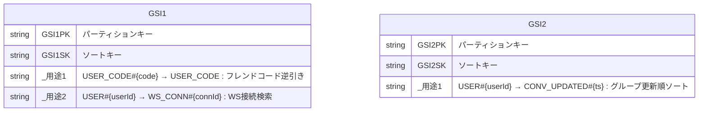

---

## 2. フロントエンド主要データ構造

### 2.1 コアデータモデル

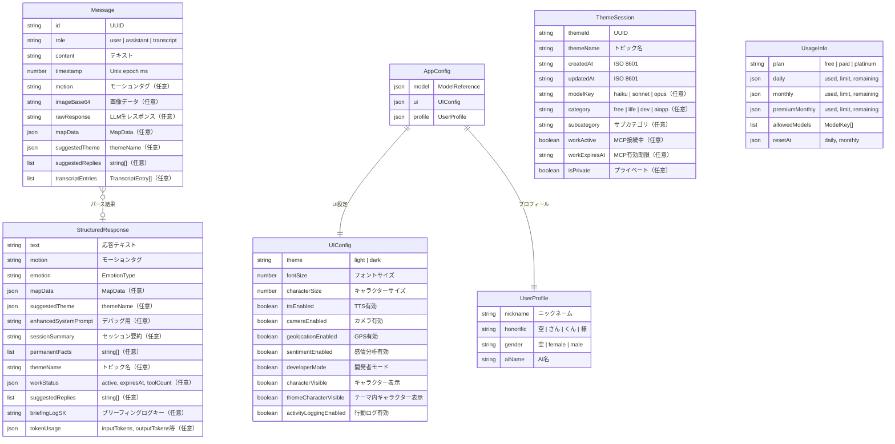

### 2.2 グループ & ソーシャル

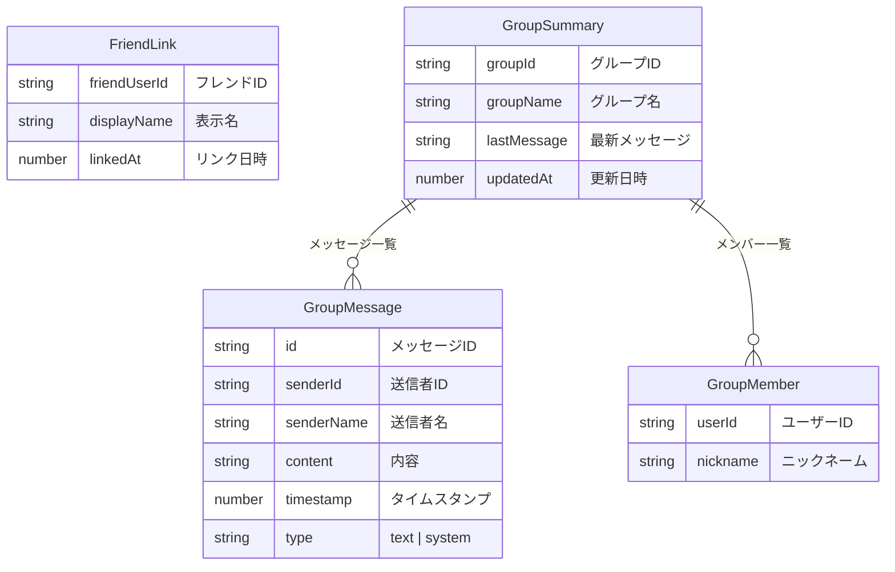

### 2.3 MCP & Live2D モデル

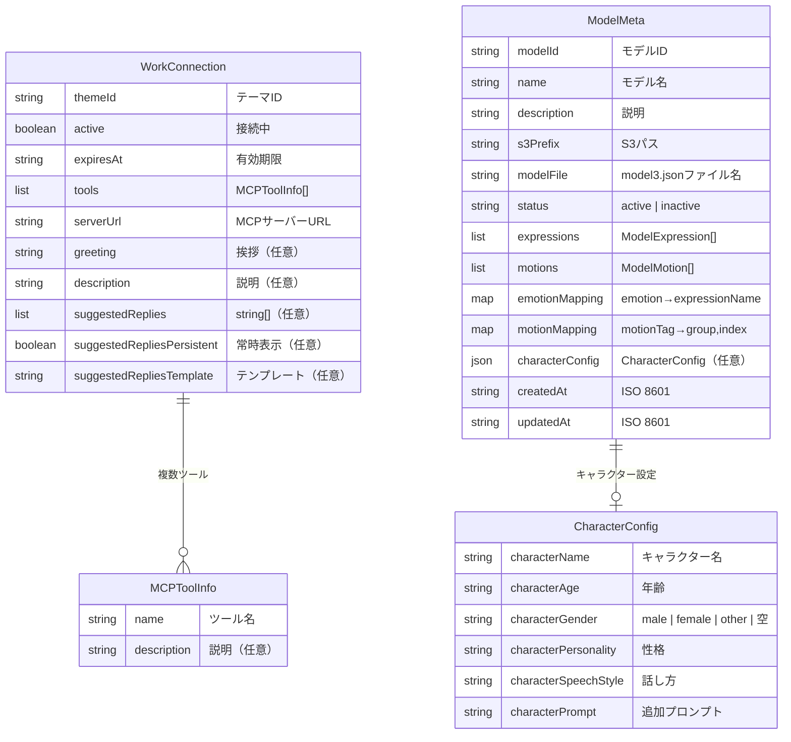

---

## 3. シーケンス図

### 3.1 チャットメッセージ送信（ストリーミング）

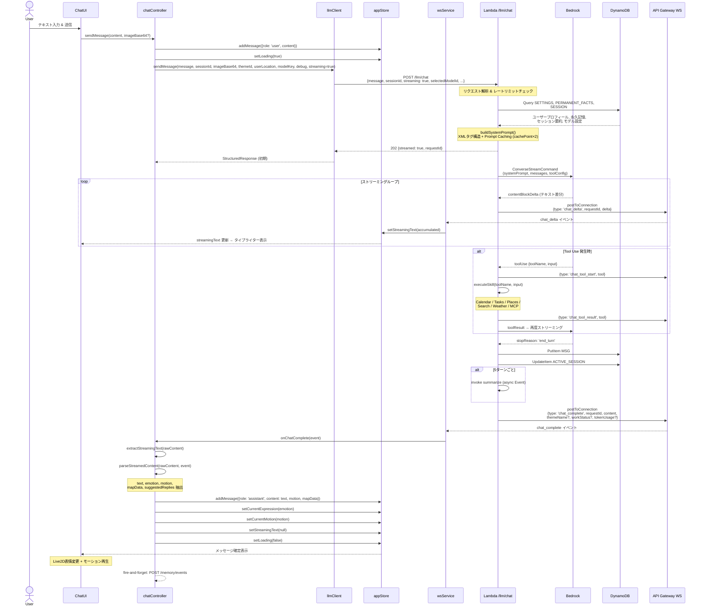

### 3.2 音声会話（VoiceChat）パイプライン

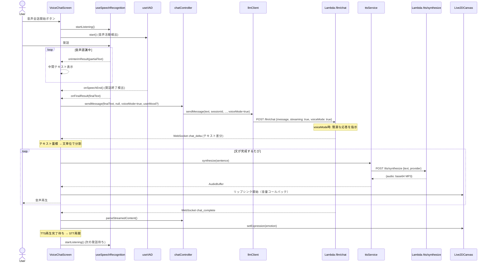

### 3.3 3層記憶管理

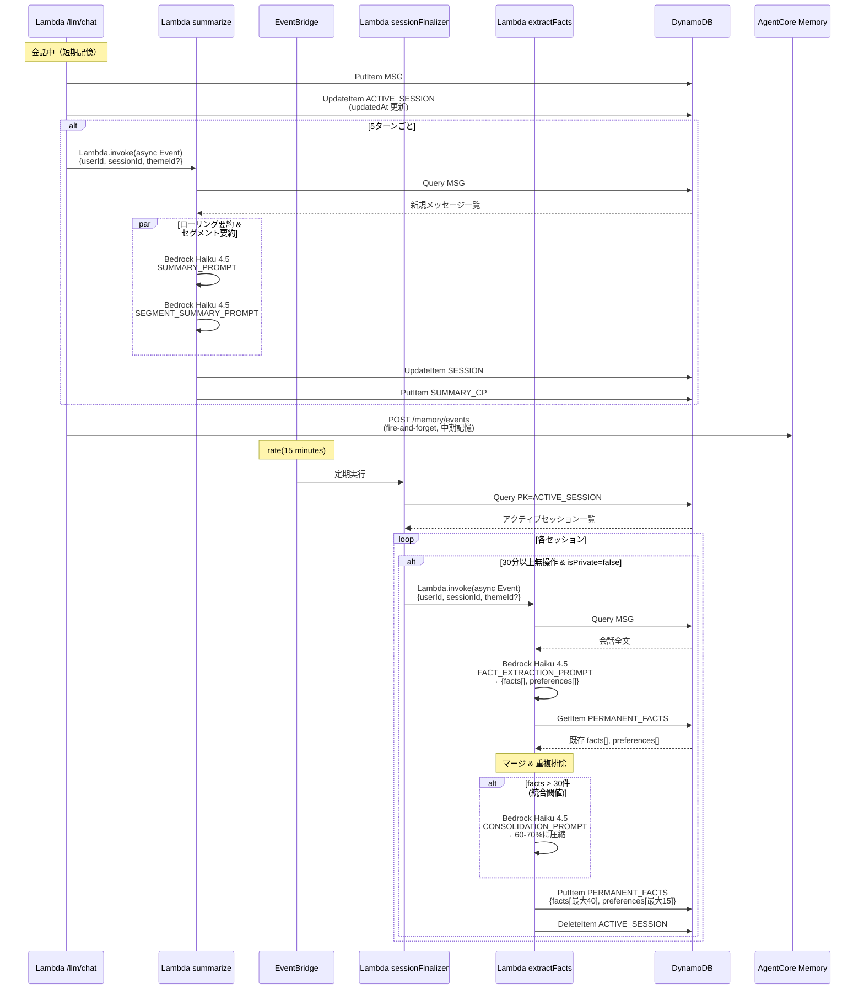

### 3.4 ブリーフィング（プロアクティブ挨拶）

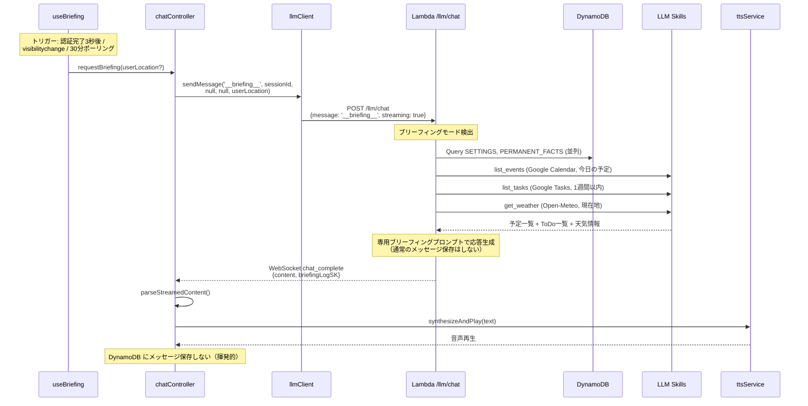

### 3.5 WebSocket 接続 & ストリーミング

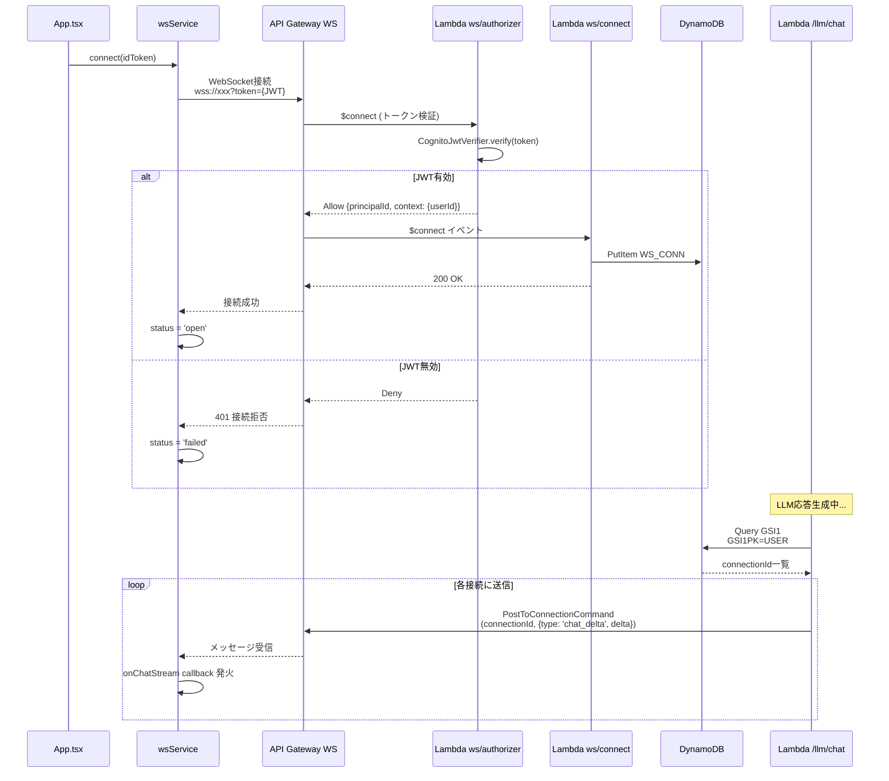

### 3.6 テーマ（トピック）作成 & チャット

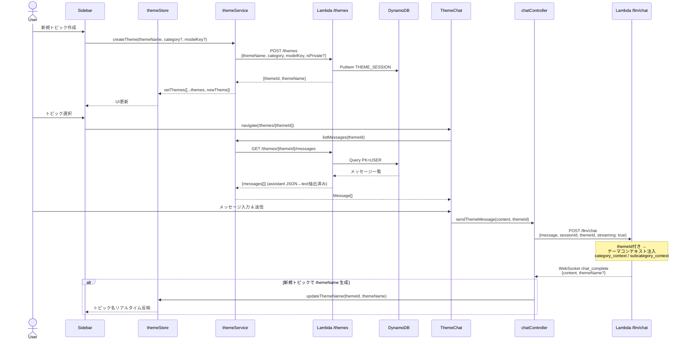

### 3.7 フレンドリンク & グループチャット

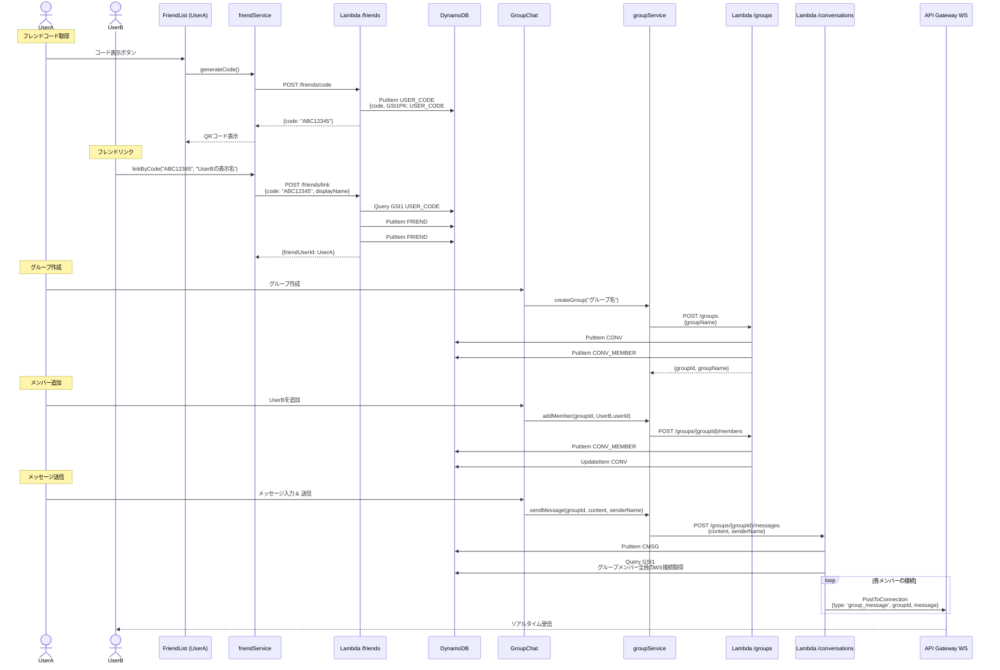

### 3.8 Live2D モデルアップロード（管理画面）

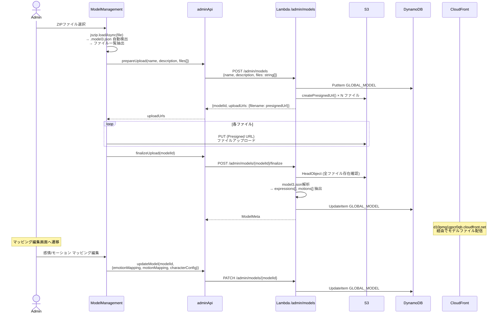

### 3.9 レートリミットチェック

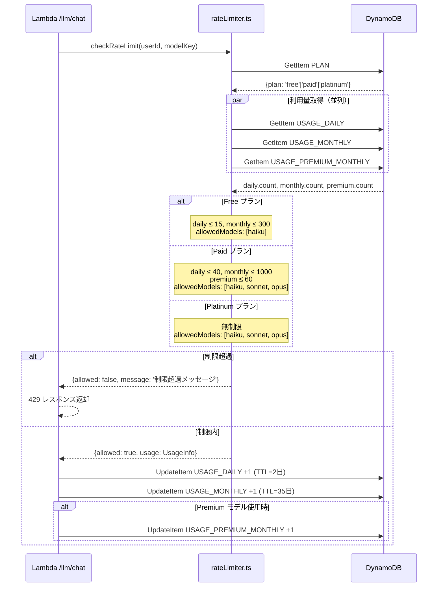

### 3.10 MCP（Model Context Protocol）接続

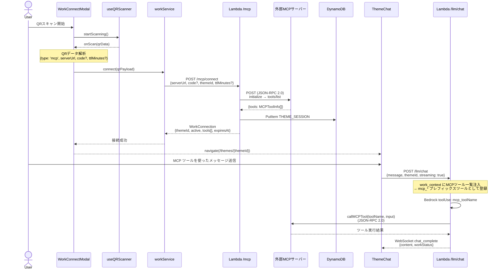

---

## 4. 補足: API リクエスト/レスポンス形式

### 共通ヘッダー

```
Authorization: Bearer {Cognito ID Token}
Content-Type: application/json
```

### 共通エラーレスポンス

```json
{ "error": "エラーメッセージ" }
```

### ステータスコード

| コード | 意味 |
|--------|------|
| 200 | 成功 |
| 202 | 受理（非同期/ストリーミング） |
| 400 | リクエスト不正 |
| 401 | 認証エラー |
| 404 | リソース未発見 |
| 409 | 競合（既にフレンド等） |
| 429 | レートリミット超過 |
| 500 | サーバーエラー |

### WebSocket メッセージ型

| type | 方向 | ペイロード |
|------|------|-----------|
| `chat_delta` | Server→Client | `{requestId, delta: string}` |
| `chat_tool_start` | Server→Client | `{requestId, tool: string}` |
| `chat_tool_result` | Server→Client | `{requestId, tool: string}` |
| `chat_complete` | Server→Client | `{requestId, content, themeName?, workStatus?, tokenUsage?}` |
| `chat_error` | Server→Client | `{requestId, error: string}` |
| `group_message` | Server→Client | `{groupId, message: GroupMessage}` |
